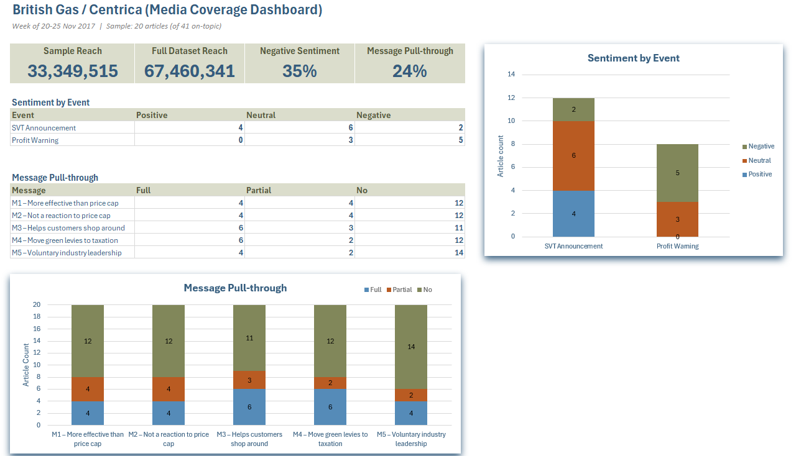

# British Gas Media Sentiment Analysis: SVT Announcement & Profit Warning Coverage (Nov 2017)

## Goal / Task
Analyze a sample subset of 15-20 articles from a dataset of media coverage to determine how
sentiment toward British Gas/Centrica changed during the week of two announcements:
the Nov 20, 2017 announcement that British Gas would abolish Standard Variable Tariffs (SVTs)
for new customers by March 31 of the following year, and the Nov 23, 2017 trading update
warning that earnings would fall below forecasts.  
The task also called for highlighting the messaging/key points of conversation during both 
announcements and how that reflected on the company, supported by written insights along with visual and qualitative elements.

## Details
_This a sentiment/content analysis. Do not expect heavy tech stack in this case study._  

- Started from a Raw Data set of articles, then used Power Query to build an "Articles" table, removing 2 duplicate-link articles from the original dataset.
- Built the 20-article sample from the 41 on-topic articles using a proportional allocation method, 3 single-article dates were set aside first, and
  the remaining 20 articles were distributed across the other dates at a ratio of 0.4146 applied to each date's article count.
- Made two adjustments to this baseline allocation, excluded the Nov 25 weekend round-up, as it largely restated coverage already captured earlier
  in the week and added no new sentiment or messaging signal; and substituted in an additional Nov 20 article in place of one of the Nov 24 picks,
  since the Nov 24 date's initial sentiment readings looked repetitive across the drafted selections and the substitution preserved tonal variety
  in the sample. This brought the SVT Announcement date total to 12.
- Logged the final 20-article sample in "Articles Read" with Publication, Date, Author, Headline, Type, Reach, Article_ID, and per-article scoring on 5 key messages plus overall Sentiment.
- Isolated 5 Primary Source Key Messages (M1-M5) from the original announcement statements/quotes, drawn chiefly from articles A2, A5, A9, and A11
  (Iain Conn's own bylined piece), each paired with a representative quote/source:
  - M1: Scrapping SVTs is more effective than a government price cap
  - M2: Not a reaction to the government's price-cap threat; long-planned
  - M3: Ending the SVT helps customers shop around for a better deal
  - M4: Green/government policy costs should move off bills onto general taxation
  - M5: This is bold, voluntary industry leadership, not something forced on the company
- For each of the 20 articles, scored pull-through of each message as Full / Partial / No, per a defined scoring scale
  - Full: appears as direct quote or faithful paraphrase, essentially unchallenged;
  - Partial: appears but qualified/softened/counterpointed;
  - No: dropped entirely or actively contradicted

## Results
- Across the 20-article sample, sentiment split 9 Neutral, 7 Negative, 4 Positive, with nearly all negative coverage falling on or after the Nov 23 profit warning. The Nov 20 announcement itself drew a mixed reception, including favorable wire coverage and Centrica's own bylined op-ed alongside early skepticism from The Independent and Reuters.
- Of the five key messages tested across all 20 articles (100 message-checks total), only 24% achieved Full pull-through, 15% Partial, and 61% were dropped or actively reframed. M3 ("ending SVTs helps customers shop around") landed best; M5 ("voluntary leadership, not forced") fared worst, with journalists more inclined to frame the move as defensive than as leadership regardless of how Centrica presented it.
- Skepticism toward Centrica's motives predates the profit warning: Reuters' own Nov 20 headline framed the SVT move as an act "to fend off" the government price cap, directly inverting Centrica's claim, and The Independent's Felicity Hannah (Nov 22) dismissed the pledge as "no silver bullet" before the profit warning had even happened, meaning the profit warning confirmed a reading several outlets had already reached rather than creating it.
- Overall: Centrica did not control the narrative around its own announcement. Its core claim of acting voluntarily, ahead of and independent from government pressure, was the least-believed part of its message, while the more modest, factual claim (that scrapping SVTs could help customers shop around) was the one that actually got repeated. By the time the Nov 23 profit warning landed, media commentary (The Independent's James Moore and a later Utility Week retrospective) was already prepared to read the SVT pledge as a PR move rather than genuine reform, the bad financial numbers made that reading unavoidable rather than introducing it.

## Tech Stack
Excel (Power Query for data loading/deduplication; formula-driven Executive Summary dashboard)

## Skills Demonstrated
Media/sentiment analysis  
Message pull-through scoring against a defined rubric  
Qualitative source coding (per-article notes on tone/sentiment)  
Data cleaning and deduplication via Power Query  
Dashboard/summary reporting  
Written insight synthesis from primary-source quotes  

### Dashboard

### 20 Sample Articles
